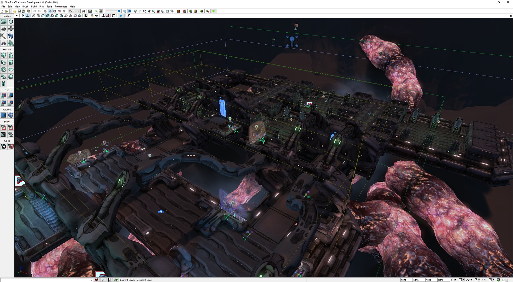
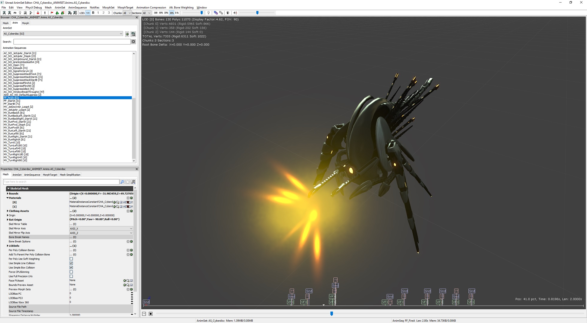

# XCOM Uncooker

The **XCOM Uncooker** is a project for XCOM: Enemy Within that allows you to (mostly) reverse the game's cooking process, making its assets openable in the Unreal Development Kit. This means you can use it to look at meshes and textures, fly around maps, view the Kismet scripts that power specific missions, etc.

This does not enable the following:

1. Viewing the game's source code. You can use [UE Explorer](https://github.com/UE-Explorer/UE-Explorer) to decompile the game code.
   * Kismet is UE3's visual scripting system, which is tied to an individual map. It controls activity such as "when a soldier enters this trigger volume, spawn more drop-in aliens" on council missions. Since this is part of the map, the Kismet is viewable in the UDK using the uncooker.
2. Creating new assets and importing them into the game (yet).
3. Creating new maps and loading them in the game (..yet?). Same issue as other assets, with some additional work needed on top.

# First time setup

Follow these steps to uncook and view the game assets. Note that some warnings during the UDK steps are normal, but errors are not; stop if you hit an error and contact me.

0. You must own XCOM: Enemy Within and have it installed. I have only tried this with [the Steam version](https://store.steampowered.com/app/225340/XCOM_Enemy_Within/), and only with the Enemy Within DLC.
1. Create a **clean and unused** installation of the September 2011 UDK release. You can get it [on this GitHub](https://github.com/chrishayesmu/XCOM-Uncooker/releases/tag/udk-installer) or from [Nexus Mods](https://www.nexusmods.com/xcom/mods/485?tab=description). This absolutely **MUST** be a new install which you aren't using for anything else. It will **not** be able to compile scripts, so if you want to create code mods for XCOM, you need two separate installations of the UDK. The installer is going to delete a bunch of stuff from the UDK folder, so please follow this instruction.
2. Download the latest [XCOM Uncooker release](https://github.com/chrishayesmu/XCOM-Uncooker/releases) and unzip it. It should contain folders called `xcom-uncooker` and `replacement-packages`, and a file called `xcom-uncooker-udk-setup.exe`.
3. Run `xcom-uncooker-udk-setup.exe` and follow the installer's directions. This will modify your brand new UDK install so it can handle XCOM's assets.
4. **Warning: this next step will take a while and bog down your computer while it's running.** The uncooking process is resource intensive and usually takes about 20 minutes on my machine.
   1. Once the UDK setup installer is done, run `xcom-uncooker\XCOM-Uncooker.exe`.
   2. When the uncooker asks for XCOM's `CookedPCConsole` folder, make sure to use the one under the `XEW` folder (e.g. `C:\Steam\steamapps\common\XCom-Enemy-Unknown\XEW\XComGame\CookedPCConsole`).
   3. When the uncooker asks for an output path, use `<UDK install path>\UDKGame\Content`. In my install, this is `C:\UDK\UDKGame\Content`.
   4. Let the uncooker run. It may appear to get stuck now and again due to particularly large or complex files.
5. Optional, but recommended: inside the `replacement-packages` folder is an `XComGame` folder. Copy `XComGame` on top of `<UDK install path>\UDKGame\Content\XComGame`, replacing existing files when prompted.
   * This will give you a bunch of UPK files that have been manually adjusted/corrected. This is mainly to make materials render correctly, as they can't be fully uncooked automatically.
   * If you aren't prompted to replace anything, you probably pasted `XComGame` into the wrong spot. Remove the copy and try again.
6. When the uncooker is complete, go to your UDK installation folder (e.g. `C:\UDK`) and run the "Update Asset Database" shortcut. It should ask if you want to compile scripts; say yes, wait for compilation to finish, then run the shortcut again.
   * Updating the asset database lets you see all of the game assets in the editor at the same time, without having to load each individual UPK file.
   * This is optional but highly recommended. It may take a minute or two.
7. When the asset database update is complete, you can close its window and click the other shortcut, "Open UDK Editor".

At this point, you should be able to browse the game assets in the UDK!

# How's it work?

## The cooking process

Cooking a game's assets in UE3 has three main effects that we're interested in:

1. Editor-only data (e.g. source data for textures and models) is removed.
2. Copies of assets are created in every seekfree package where they are needed, usually resulting in the asset's original UPK file not being present in the cooked game.
3. The cooked packages are compressed on disk.

There are some other effects, but they aren't important for our purposes.

## Uncooking process

Theoretically, uncooking is simple:

1. Parse the cooked files and all of the objects they contain.
2. Reconstruct the uncooked asset paths based on the asset packages, which remain intact within the cooked files.
3. Copy each cooked object into its uncooked package equivalent, adjusting any references to other objects so that they remain valid in their new location.
4. Serialize the uncooked packages to disk, updating their metadata to match their contents.

The devil is in the details, of course, which is why this simple process took 6 months to work through.

## XCOM-specific handling

As UE3 licensees, Firaxis had access to the C++ source of the engine, and could make modifications to it. With our publicly-available UDK installation, we do not have the same capability. Therefore, part of this project is discovering those Firaxis-specific changes and making them compatible with the public UDK. Without doing this, loading any modified or Firaxis-added native type would crash the editor.

A few Firaxis types have no equivalent in the public UDK, and are completely stripped out of the uncooked files. The most important of these is a native class called `XComWorldData`, which is in every map file, presumably containing navigation/visibility data and similar. Their format is not yet decoded, but it will have to be if we want to support fully custom maps in the future.

# Known issues

## Some assets are organized into folders, but most are not

Sorry, figuring out where all the assets should go is pretty tedious and I haven't finished it yet. Future versions of the uncooker will likely do a better job organizing the UPK files.

## Shaders/textures are missing, objects render as all black

> If you didn't copy the contents of the `replacement-packages` folder as mentioned in the installation steps, close the UDK and do so. It will help with a lot of these missing shaders.

Shaders are very tricky to uncook, and for this project, they largely aren't. The problem is that UE Materials have all of their non-parameter expressions removed in the cooking process. This is because the shader is shipped pre-compiled in the various shader cache packages, so the expressions aren't needed at runtime. (Parameter expressions remain, presumably for use in some form of runtime binding.)

Because the expressions are removed, a lot of the uncooked materials have nothing attached to their outputs; thus, they're fully black. The uncooker makes some efforts to help with this, automatically connecting certain parameters to their corresponding outputs if nothing is already hooked up, but this is a stopgap at best. Many materials have to be fixed by hand.

## Packages/maps are taking a long time to load

You don't have any cached shaders, so they're being compiled whenever you encounter them. As you use the UDK more, your shader cache will grow and load times will get much quicker.

## Objects don't have thumbnails in the editor until double clicking or their containing UPK is fully loaded

This is expected, unfortunately. The UPKs shipped with the game don't have editor thumbnails, and there's no way to generate them via a commandlet like we can do for the asset database. The only way to generate the thumbnails is by having the UDK open.

If you fully load a package, all of its assets will have thumbnails generated. You can theoretically do this for every package and save them back to disk, though obviously it'll be slow.

Note that for particle systems, you have to manually create a thumbnail in the particle system editor. This isn't an uncooking limitation, it seems like this is just how the UDK works.

## Node-based editors (Kismet, AnimTrees) have their nodes in the wrong spots

The data on where to place these nodes is removed during the cooking process, so they're mostly in the default (0, 0) position.

For Kismet nodes, there is some supplementary data which isn't cooked out, that provides hints as to where the node should be. XCOM Uncooker tries to use this to place some nodes, but it isn't perfect.

There's probably more that can be done in this regard (for Kismet and other types), and future versions of the uncooker may do a better job placing these nodes.

# FAQs

## Why can't I make new game assets?

Technically you can make them, but you can't get the game to load or compile their materials. Runtime compilation of materials is disabled in XCOM: EW, and there's not currently a way to precompile them and make them available to the game.

[Long War: Community Edition](https://github.com/chrishayesmu/XCOM-LW-CommunityEdition) uses executable patching to re-enable runtime compilation of materials, but it causes very noticeable hitches the first time any new material is encountered and compiled. Precompilation of materials (i.e. cooking asset packages) should be doable before LWCE is released.

## Why can't I make new maps?

First, the same issue as assets. The materials we're using in our UDK are viewed as distinct from the game's own materials, so they have to be recompiled, even if we're using assets already in use in other maps.

In addition, XCOM: EW's map files contain some extra data that our UDK can't provide. This hasn't been fully reverse engineered yet, but likely includes navigational data for which tiles are pathable, where cover exists, etc. In Firaxis's UDK, this would all have been calculated automatically when cooking the map. Before we can support fully custom maps, we will probably need to reverse engineer the data format, write a utility to do the same calculations, and append it to the cooked map file.

# Credits

This specific project is by me (usually known as SwfDelicious). But it builds on an enormous body of work by others in the community, without which it would not be possible. My thanks to, in no particular order:

* [EliotVU](https://eliotvu.com/), author of [UE Explorer](https://github.com/UE-Explorer/UE-Explorer). This tool was invaluable for digging into the structure of UPK files.
* [Gildor](https://www.gildor.org/smf/index.php/board,3.0.html), author of [UE Viewer](https://github.com/gildor2/UEViewer) (also known as "umodel"). Similar to UE Explorer, UE Viewer was very helpful when investigating the package structure.
* wghost, or Wasteland Ghost, author of [UPKUtils](https://github.com/wghost/UPKUtils). These tools were necessary to decompress the game files for UE Explorer (before XCOM Uncooker gained decompression support at the very end of the project).
* robojumper, whose [UE3 posts](https://robojumper.github.io/) were very helpful for understanding high-level engine internals.
* ruderubik, for her general knowledge and advice of UE3 and reverse engineering, and her unwavering support.
* [ImHex](https://github.com/WerWolv/ImHex), a very neat hex editor whose pattern language was quite helpful for figuring out some XCOM-specific data formats.
* [Inno Setup](https://jrsoftware.org/isinfo.php), which is used for the UDK setup installer within the uncooker.
* Lots of miscellaneous people who have done research and shared their findings online over the years.
* [Epic Games](https://epicgames.com/), for creating Unreal Engine and leaving [UE3's documentation](https://docs.unrealengine.com/udk/Three/WebHome.html) online to this day, including detailed information on how cooking assets works.
* And lastly, [Firaxis Games](https://firaxis.com/), for making a game worthy of all this effort.